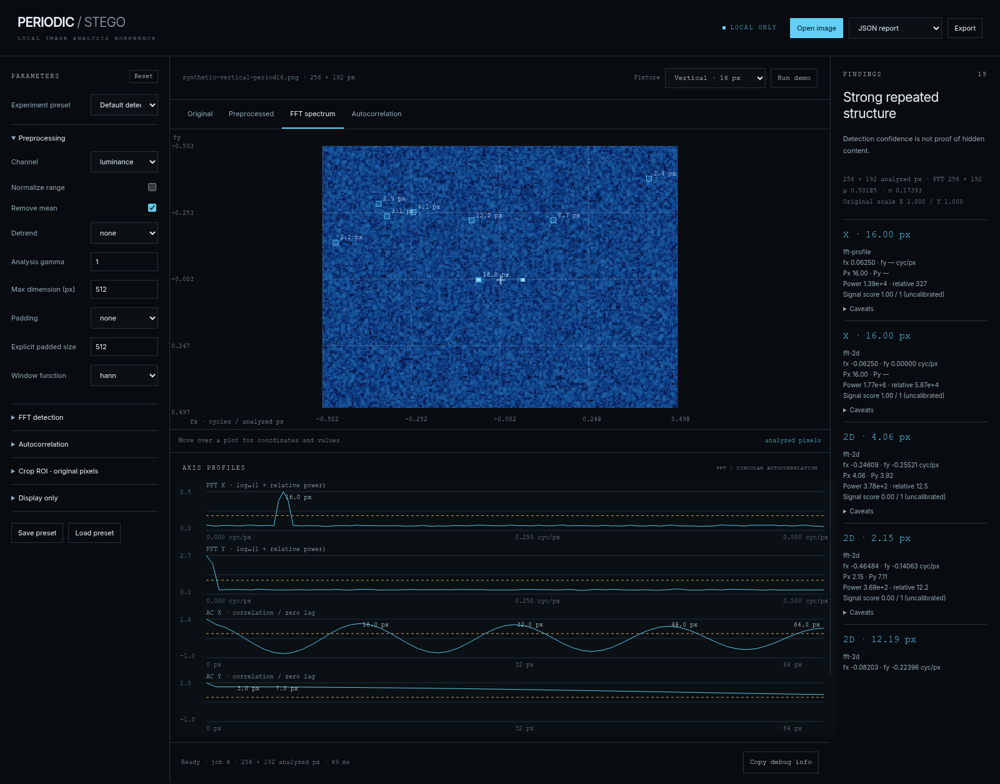

# periodic-stego

A browser-local image-forensics and periodic-structure workbench. Open an image, inspect the original, FFT spectrum, circular autocorrelation, X/Y profiles, ELA at multiple JPEG qualities, noise residuals, coarse clone candidates, JPEG/PNG structure, and horizontal stereogram disparity.

[Open the workbench](https://vkkkv.github.io/periodic-stego/)

License: [GNU AGPLv3 only](LICENSE) (`AGPL-3.0-only`).



A periodic peak is evidence of repeated structure, **not proof of hidden text**. Automatic screening does not decode payloads or guess their encoding. Manual extraction tools operate on original file bytes using explicit parameters. Browser/Canvas pixels are not byte-exact source samples: fully transparent RGB can be discarded and semi-transparent RGB rounded. Use a raw decoder for pixel-bit steganography.

## Run the web app

Use Node.js 24 LTS (also supported: 22.12+ in the 22.x line, or 26+).

```sh
cd web
npm install
npm run dev
```

Open the local URL printed by Vite. Choose a local file, drag it onto the page, paste a PNG/JPEG from the clipboard, or select a synthetic fixture and click **Try sample**.

Use the **中文 / English** language selector in the header to switch the workbench language. On first visit, Chinese browser locales select Simplified Chinese; other locales fall back to English. A valid saved choice takes precedence. Switching updates controls, help, statuses, findings and plot labels without discarding the image, ROI or parameters, or rerunning analysis. The language preference is stored locally when browser storage is available; the app still works when storage is blocked. JSON report and preset keys, enum values and numerical data remain language-independent (canonical English); labeled PNG exports use the active interface language.

```sh
npm run build
npm run preview
```

The production app is static: `web/dist/` can be served by any static host. Vite uses relative asset and Worker paths, including GitHub Pages project subpaths. No backend is needed.

## Privacy and input limits

- Images are decoded and analyzed locally using Canvas and a Web Worker. There is no upload endpoint, analytics, external font, CDN dependency, or account system.
- The host still receives normal requests for the site assets. Image data and parameters are not sent with those requests.
- Files are limited to 32 MiB, 16 megapixels, and 16384 pixels per side before decoding. Larger files must be resized locally first. PNG, JPEG, BMP and GIF are accepted; animated frame analysis, SVG, RAW and arbitrary URL inputs are not supported.
- The default FFT analysis limit is 512 pixels on the longer ROI dimension, adjustable up to 1024. Area-average downsampling happens in the Worker. Padding is bounded to 2048 × 2048. Horizontal repeat matching separately samples native-resolution rows; its diagnostic raster is limited to 512 pixels per side and may be reduced further to bound matching work.
- Images/results are held in memory, not persisted in local storage. Exported reports include the image filename, dimensions, byte size, and file modification time, but no pixels. Review this metadata before sharing reports. Debug info excludes the filename and pixel data.
- Forensic screening starts automatically after decoding, independently of FFT parameter changes. **Forensic results** reopens the panel; errors expose a retry action. Replacing the source immediately invalidates its forensic exports. The panel provides SHA-256, JPEG quantization/quality hints, PNG chunk inventory, limited EXIF structure, multi-quality ELA, median-filter noise residuals, and coarse repeated-block candidates. These are screening signals, not authenticity verdicts.
- ELA composites transparency onto white and caps the working image at 2048 pixels per side. Noise/clone screening caps input at 512 pixels per side and scales maps back to working dimensions; it is not native-resolution exhaustive copy detection. Printable strings are bounded to 100 runs of 512 characters. RGB PCA now computes centered population covariance, exposes all three principal components and reports eigenvalues/loadings/explained variance. Each component is independently scaled, with zero-variance maps black; it operates on the same white-matted working image, independently of signal ROI/parameters. Luminance bands remain a fixed false-color map, not an interactive level sweep.
- **Extraction tools** exposes structured PNG/GIF trailing-data extraction, indexed-BMP sentinel extraction, raw PNG bitplanes/bitstreams, configurable channel-difference and local-anomaly masks, prime-value masks, pixel-coordinate traversal with optional Morse conversion, bounded byte inversion/XOR, structured JPEG EOI/trailing-data/carving inspection, and explicit browser `BarcodeDetector` recognition when available. Every operation has explicit parameters, bounded input/output, deterministic JSON/bin/PNG outputs, and no automatic payload inference. Parameter/source changes invalidate prior output.
- **Raw PNG bitplane / bitstream** uses a native PNG decoder with explicit sample conventions: packed 1/2/4-bit samples are MSB-first and expanded to 0–255; 16-bit samples are big-endian and represented by their high byte; Adam7 passes are reconstructed into image coordinates. It preserves hidden RGB under alpha zero without Canvas fallback. Choose a channel/bit for preview, or ordered channels, row/column traversal, byte packing, bit offset and output byte count for extraction. Previews are bounded; downloads preserve all extracted bytes. There is no challenge catalog, answer preset or automatic payload inference.

### EXIF thumbnail

Choose **EXIF thumbnail** in the forensic panel to inspect the JPEG explicitly referenced by TIFF IFD1 in a JPEG Exif APP1 segment. The parser validates byte order, field types, directory chains and segment-local bounds, then safely decodes the extracted JPEG for preview. **Export view** downloads the exact embedded JPEG bytes. Missing, malformed or unsupported thumbnails show an explanation and disable export; the main image is never substituted. Uncompressed TIFF thumbnails, BigTIFF and PNG EXIF thumbnails are not implemented. **Decoded working image** remains a separate view.

PCA, ELA and clone maps do not establish authenticity or prove hidden content. C2PA scanning remains an unverified marker hint, not manifest/signature validation. Canvas can lose RGB under transparency; byte-oriented extraction and the native PNG tools avoid that raster conversion. See [development plan](docs/FORENSIC-DEVELOPMENT.md) and [verification](docs/VERIFICATION.md).

## Workbench controls

**Preprocessing:** luminance/R/G/B/Alpha, range normalization, mean removal, row/column/least-squares plane detrending, analysis gamma, ROI, max dimension, zero padding, and none/Hann/Hamming/Blackman windows. Alpha is available when the decoded image has non-opaque pixels. Enter ROI coordinates or drag a rectangle on the original image. ROI coordinates are in original-image pixels.

**Detection:** DC exclusion radius and peak separation in FFT bins, count per source, relative-power threshold, autocorrelation method, normalization, X/Y lag limits, minimum lag, lag threshold, and lag separation. Direct circular autocorrelation is a verification fallback limited to 32 × 32 padded pixels; larger inputs show an error rather than silently switching algorithms.

**Display only:** magnitude/power/log-power, display gamma, frequency zoom, conjugate markers, axes/grid, period labels, interpolation, image scale, profile frequency/period labels, profile zoom/pan, and wraparound warning visibility. These settings redraw existing results without changing the numerical Worker job. Analysis gamma is separate and does change the input signal.

Default, stripe, subtle-noise, CTF, JPEG-artifact, and conservative presets change parameters only. Save/load preset JSON preserves all analysis/display settings; imported presets are validated, not executed. Changing the source image clears ROI and resets padding to prevent stale dimensions.

Parameter changes are debounced by 150 ms. Superseded Workers are terminated immediately and all responses are checked against the current job ID. The previous plot stays visible while marked **Updating**; stale or failed analyses cannot be exported as current results.

## Numerical conventions and interpretation

The TypeScript implementation uses Float64 throughout, with radix-2 FFTs and Bluestein convolution for arbitrary lengths. It has no runtime package dependencies. Forward transforms use `exp(-2πikn/N)` without scaling; inverse transforms use the positive sign and divide by the sample count (width × height in 2D). `fftshift` moves each axis by `floor(N/2)`.

Pipeline order: crop → area-average downsample → channel values divided by 255 → analysis gamma → optional min/max normalization → detrend → optional mean removal → separable window → zero padding → FFT. Luminance is `0.2126 R + 0.7152 G + 0.0722 B` on decoded channel values; this is not linear-light color management. Browser image/color/EXIF decoding may differ from Pillow.

Frequency is measured in cycles per **analyzed pixel**. Period is `1 / |frequency|`; zero frequency has no finite period. Multiply X/Y periods by the report's `scaleX`/`scaleY` to express them in original-image pixels. Zero padding changes FFT bin spacing, not the effective physical resolution.

Circular autocorrelation is `IFFT(FFT(x) × conjugate(FFT(x)))` on the padded grid. AC candidates report actual pixel lags, not reciprocal FFT-bin positions. Opposite lag directions and Fourier conjugate pairs are merged within their respective candidate source. X/Y FFT profiles and 2D peaks remain separate evidence sources; the same physical period can appear in multiple sources and at harmonics.

FFT detection uses local maxima, DC exclusion, minimum separation, and a relative-to-median-background score. A separate spectral-concentration factor, compensated for zero-padding, prevents large noise outliers from automatically becoming strong findings. The displayed 0–1 confidence is an **uncalibrated signal-strength heuristic**, not a statistical probability. Circular autocorrelation candidates alone do not set the strong-periodicity status; a separately verified native horizontal repeat can. Thresholds are exploratory controls, not a universal significance test.

JPEG blocks, resizing, scanlines, moiré, image boundaries and ordinary textures can all create peaks. Windows broaden peaks; aggressive detrending can remove the signal of interest; downsampling may suppress/alias high-frequency content; padding and circular wraparound affect interpretation. Weak/no findings do not rule out steganography. Inspect stability across channels, crops, windows and scales before drawing a conclusion.

## Magic Eye / random-dot stereograms

Random-dot stereograms can have a strong horizontal repeat without concentrated FFT energy. Area averaging can also destroy their native-pixel correspondence. The workbench therefore runs an independent horizontal matching pass without lowering the FFT noise threshold.

1. Open the image and look for **Horizontal repeat** in Findings. Its period is already in original-image pixels, unlike FFT/AC candidates' analyzed-pixel periods. All candidates also show original-pixel period estimates.
2. Select **Stereogram disparity** (立体图视差) to inspect local separation changes. Blue marks unmatched or ambiguous pixels; brighter gray means larger signed disparity. Hover for the original coordinate and signed value. Display gamma changes contrast only.
3. Export **Stereogram disparity PNG** or **JSON report**. The report includes the native period, correlation, row support, search bounds, matching coverage and thresholds, but no image or disparity buffers. The view/export is disabled when no supported repeat is found.

The native pass uses the selected ROI and channel, but intentionally ignores FFT resampling, analysis gamma, normalization, detrending, window, padding and FFT/AC detection controls. **Stereogram heuristic** controls can constrain the native period search in original ROI pixels: the defaults search `8..min(1024, floor((ROI.width-1)/3))`, while a nonzero maximum applies a tighter cap. The minimum cannot exceed a nonzero maximum. Excluding a fundamental period can still select an accepted harmonic, so period bounds constrain candidates rather than asserting the fundamental. The pass requires at least 8 rows, samples up to 32 rows, correlates first differences with nonwrapping overlap-normalized Pearson correlation, and requires correlation ≥ 0.55, row support ≥ 60% at correlation ≥ 0.35, and local peak prominence ≥ 0.15. It chooses the shortest accepted peak within 90% of the strongest score to reduce harmonic selection.

Local matching defaults to integer separations from `max(2, floor(0.55 × period))` through `ceil(1.05 × period)`. The two separation-ratio controls can widen or narrow that interval; widening increases matching work and can increase ambiguous matches. Matching uses 11-pixel horizontal SSD windows. A match needs texture variance, cost no greater than that variance, and ≥ 0.15 uniqueness over the runner-up; at least 25% of output samples must match. Disparity is `period - local separation`, located at the right correspondence endpoint, **not calibrated physical depth**. Unsupported borders are not wrapped. The grayscale range includes both negative and positive supported disparities.

These are conservative heuristics, not a general stereogram decoder: vertical repeats, very short/large periods, heavy compression/resizing, broad correlation peaks, or depth changes outside the search range can be missed. Ordinary tiled texture can pass. Neither a repeat nor a disparity image proves hidden text; the tool does not OCR or guess a payload.

### Algorithm references

The native-row approach was informed by Jérémie Piellard's [stereogram-solver processing](https://github.com/piellardj/stereogram-solver/blob/ef4e8251dde6d7ecd4856bc43be70fe3ec5484f3/src/ts/processing.ts) and [visualization](https://github.com/piellardj/stereogram-solver/blob/ef4e8251dde6d7ecd4856bc43be70fe3ec5484f3/src/ts/visualization.ts): that solver estimates a global RGB difference offset and displays its difference contours, not dense depth. The [stereogram-webgl shader](https://github.com/piellardj/stereogram-webgl/blob/44ceea39f4d9948f3abfc526f185eac8406dc6ce/src/shaders/stereogram.frag) shortens local stripe spacing with height, motivating a wider local separation search. This project's Pearson/SSD implementation is independent; no upstream runtime dependency or source was vendored.

## Exports

- JSON report: tool version, timestamp, image metadata (no pixels), every parameter, preprocessing dimensions/scales, FFT convention, candidates, native horizontal repeat diagnostics when present, statistics, warnings and caveats.
- PNG: original image, preprocessed data, FFT heatmap, autocorrelation heatmap, stereogram disparity when available, or the four labeled profile plots. Heatmap PNGs include axes and selected overlays/zoom; the interactive coordinate readout and findings remain in the UI/JSON report.
- Preset JSON: all analysis/display parameters, suitable for reloading with the same input image. Presets do not contain the image.
- Forensic PNG: the selected ELA, noise residual, or clone-candidate visualization. Metadata is displayed in the UI rather than embedded in the image.

Composite report PNG export is not implemented. Browser decoding is the remaining platform-dependent part of reproduction.

## Tests and fixtures

From the repository root:

```sh
python -m venv .venv
. .venv/bin/activate
python -m pip install -e '.[dev]'
python -m pytest -q
python scripts/generate_fixtures.py
```

From `web/`:

```sh
npm ci --ignore-scripts
npm run format:check
npm test
npm run build
npx playwright install chromium
npm run test:e2e
```

Unit tests compare complex FFTs with direct DFT, inverse roundtrips, odd-size shifts, a NumPy-generated numerical oracle, direct/FFT AC agreement, periods 8/16/32, horizontal/both-axis structure, conservative noise, constant/RGB/Alpha inputs, ROI, downsampling, padding, validation and Worker races. Native matching regressions use an independent color random-dot copy-constraint generator: original-pixel periods, manual period/separation bounds, positive/negative and wider local disparity, harmonic behavior, independent color-noise/gradient/edge controls, FFT averaging cancellation, ROI/channel invariance, work bounds and signed rendering. Browser cases additionally encode/decode the stereogram as JPEG and at 0.5× scale. Fixtures in `web/tests/fixtures/` are reproducibly generated synthetic images, not photographs.

Playwright exercises PNG drag/drop and JPEG file selection, real plots, analysis/display controls, report and PNG downloads, preset roundtrips, corrupt/empty/oversize input, 1024-pixel responsiveness, rapid-change supersession, replacement loads, a 390-pixel viewport and reduced motion. Locale regressions additionally cover saved/blocked storage, unchanged ROI/parameters/reports, switching during a pending Worker, translated errors and treating filenames as text. The complete suite targets Chromium, Firefox and Playwright WebKit (Safari engine). WebKit is not a substitute for an actual macOS Safari release check.

Detailed execution evidence, review repairs and verification limits: [docs/VERIFICATION.md](docs/VERIFICATION.md).

## Python reference and batch fallback

The preserved NumPy/Pillow CLI is a separate, simpler reference, not a server for the web app:

```sh
python -m periodic_stego demo --output /tmp/periodic-stego-demo
python -m periodic_stego analyze image.png --json report.json --diagnostics diagnostics/
```

The CLI uses mean removal, no window and no resampling. For numerical comparison, use those same settings in the web app. Detection heuristics and report schemas intentionally differ; Python remains a legacy reference, not a bit-for-bit clone of the full web UI, and does not implement the native stereogram/disparity pass. Its autocorrelation output uses true `lag_pixels` / `period_pixels` and `normalized_correlation`. Spectral relative power now uses the complete non-DC background, including zero-power bins, rather than the median of positive bins; this makes a pure noiseless two-pixel alternating pattern set the summary boolean while preserving its Nyquist profile peak.

## Deployment

The `Verify and deploy Pages` GitHub Actions workflow runs Python tests, formatting checks, web unit tests, production build, and the complete Chromium/Firefox/WebKit suite before publishing. The deploy job is restricted to `main` and has only Pages/OIDC write permissions. Actions use native Node 24 runtimes and are pinned to commit SHAs. Set repository Pages source to **GitHub Actions**. Pull requests run verification without deployment.

The site is intended for local files, CTF handouts and authorized forensic analysis. It neither scans external targets nor performs payload recovery.

## License

Copyright (C) 2026 periodic-stego contributors.

Unless a file states otherwise, this project's code, documentation and generated synthetic fixtures are licensed under the **GNU Affero General Public License, version 3 only** (`AGPL-3.0-only`). See [LICENSE](LICENSE) for the full terms. The software is provided **without warranty**.

You may use, modify and redistribute covered work under that license. When distributing a covered build, provide the corresponding source as required by the license. If you modify the program and let users interact with it remotely over a network, section 13 requires a prominent offer for those users to obtain the corresponding source of your version. This paragraph is a summary; the license text governs.

The workbench footer links to the license and [source repository](https://github.com/VKKKV/periodic-stego). Production builds bundle the full license as an asset, downloadable as `LICENSE.txt`; Python distributions include the same license. When publishing a fork or modified build, update the source link to your corresponding source and retain the applicable notices and license. Dependencies retain their own licenses; the referenced stereogram projects were studied, not vendored or relicensed. Opening or exporting an image does not by itself place that image under AGPLv3.
